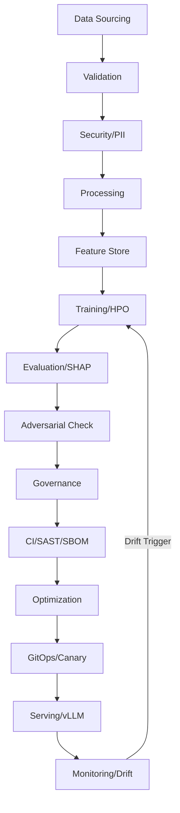

# 🏛 Architecture Guide: The SAMOS Intelligence Factory

To understand the **Secure Advanced MLOps & Orchestration System (SAMOS)**, think of it as a **High-End Automated AI Production Plant**.

## 🏎 The Factory Analogy

### 1. DataOps (The Raw Material Refinery)

* **Phases 1-5**: We don't just take any raw data. We source it, test it for chemical purity (**Great Expectations**), remove hazardous materials (**PII Masking**), and store the refined features in a high-speed warehouse (**Feature Store**).

### 2. MLOps (The Engine Laboratory)

* **Phases 6-11**: This is where we design the "Engine" (The Model). We version every blueprint (**DVC**), track every experimental trial (**MLflow**), and find the perfect fuel-to-air ratio for performance (**Optuna HPO**).

### 3. ModelSecOps (The Proving Grounds)

* **Phases 12-16**: Before the AI is released, we crash-test it against attackers (**Adversarial Robustness**), verify it treats all users fairly (**Ethical Bias Check**), and secure official safety certifications (**Automated Governance**).

### 4. DevSecOps (The High-Precision Assembly Line)

* **Phases 17-21**: We assemble the final product in a sterile container environment (**Docker**), check for structural defects in the code (**SAST/DAST**), and optimize the aerodynamics for speed (**TurboQuant/Pruning**).

### 5. SRE & CD (The Global Operations Center)

* **Phases 22-25**: We deploy the AI via a smart logistics network (**GitOps/ArgoCD**). We monitor real-world performance (**Planetary Telemetry**) and if we detect "part wear" (Data Drift), the system automatically triggers a factory recalibration (**Continuous Training**).

## 📊 Master Flowchart

## 🛠 Strategic Domains

| Domain | Responsibility | Core Tools |
| :--- | :--- | :--- |
| **Source** | Data Integrity & Sovereignty | DuckDB, Great Expectations, Presidio |
| **Soul** | Intelligence & Optimization | PyTorch, MLflow, Optuna, vLLM |
| **Judge** | Ethics & Security Audit | ART, SHAP, ZK-Proofs |
| **Purity** | Supply Chain & Code Health | Bandit, Ruff, Syft, Docker |
| **Guardian** | Global Scaling & Reliability | FastAPI, Kubernetes, ArgoCD, Prometheus |
