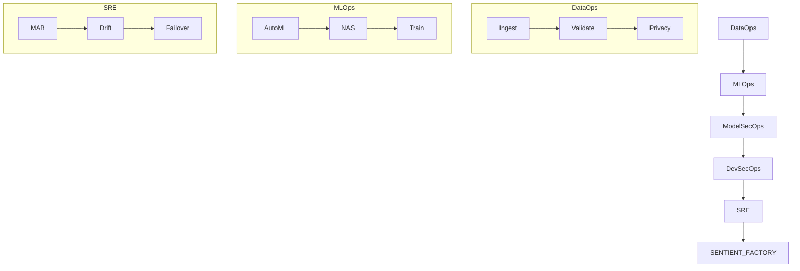

# 🗺️ Visual Architecture Map

```mermaid
graph TD
  A[DataOps] --> B[MLOps]
  B --> C[ModelSecOps]
  C --> D[DevSecOps]
  D --> E[SRE]
  E --> F[SENTIENT_FACTORY]
  subgraph DataOps
    A1[Ingest] --> A2[Validate] --> A3[Privacy]
  end
  subgraph MLOps
    B1[AutoML] --> B2[NAS] --> B3[Train]
  end
  subgraph SRE
    E1[MAB] --> E2[Drift] --> E3[Failover]
  end
```