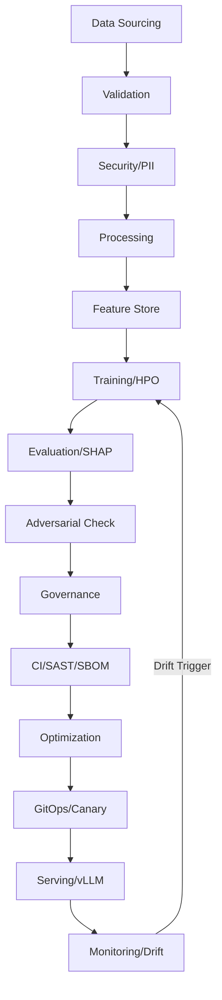

# 📝 SAMOS: Secure Advanced MLOps & Orchestration System
 
A high-assurance, end-to-end MLOps & DevSecOps factory for mission-critical AI workloads. Designed for both **Structured Data** and **SAMOS (LLM)** fine-tuning with 25 specialized phases of automated excellence.

✨ Features
 
- **DataOps Foundation**: Automated sourcing, validation (Great Expectations), PII masking (Presidio), and feature evolution.
- **MLOps Intelligence**: Distributed training, neural architecture search, hyperparameter optimization (Optuna), and experiment tracking (MLflow).
- **ModelSecOps Governance**: Adversarial robustness testing (ART), ethical bias audits, and immutable governance ledgers.
- **DevSecOps Purity**: Self-healing code, supply-chain hardening (SBOM), and automated red-teaming.
- **SRE & CD Resilience**: GitOps (ArgoCD), canary deployments, proactive drift forecasting, and planetary-scale latency sync.
- **Dual Pipeline Support**: Switch between specialized LLM fine-tuning and full 25-phase structured data factories.
- **Visual Intelligence**: Real-time interactive dashboards and automated architecture mapping.

🛠️ Tech Stack
 
| Technology | Purpose |
| :--- | :--- |
| **Python 3.12** | Core Runtime |
| **FastAPI** | High-Performance Serving |
| **MLflow** | Experiment Tracking & Model Registry |
| **DVC** | Data & Model Versioning |
| **Optuna** | Hyperparameter Optimization |
| **ART** | Adversarial Robustness Testing |
| **Docker** | Containerization |
| **Kubernetes** | High-Availability Orchestration |
| **ZAP** | Dynamic Application Security Testing (DAST) |
| **Bandit/Ruff** | Static Analysis Security Testing (SAST) |

🚀 Quick Start
 
Prerequisites
 
- **Python 3.12+**
- **Docker** (for containerized deployment)
- **Node.js** (for documentation tools)
- **PostgreSQL** (Optional, defaults to SQLite for local tracking)

Setup
 
```powershell
# Clone the repository
git clone https://github.com/your-org/samos.git
cd samos
 
# Run the high-assurance setup script
.\setup.ps1
```

Manual Setup
 
```bash
# 1. Install specialized dependencies
pip install -r requirements.txt
 
# 2. Initialize tracking ledger
export MLFLOW_TRACKING_URI="sqlite:///mlflow.db"
 
# 3. Launch the factory (Structured Mode)
python main.py
 
# 4. Launch the factory (LLM Mode)
python main.py llm
 
# 5. Start the production neural core
uvicorn src.sre.serve:app --host 0.0.0.0 --port 8000
```

🔐 System Access
 
| Domain | Access Level | Description |
| :--- | :--- | :--- |
| **Operator** | Full Access | Complete control over the 25-phase factory |
| **Auditor** | Read-Only | Access to governance ledgers and bias reports |
| **Researcher** | Experiment Access | Create and track new training runs in MLflow |

📡 Pipeline Components
 
Execution Orchestration
 
| Method | Command | Description |
| :--- | :--- | :--- |
| **POST** | `/predict` | Inference via the Production Neural Core |
| **GET** | `/health` | SRE Liveness and Readiness check |
| **RUN** | `python main.py` | Full 25-phase Structured Pipeline |
| **RUN** | `python main.py llm` | Specialized LLM Fine-Tuning Pipeline |

SRE & Monitoring
 
| Component | Endpoint / Script | Description |
| :--- | :--- | :--- |
| **Dashboard** | `samos_dashboard.html` | Real-time command center |
| **Drift** | `src/sre/concept_drift.py` | Continuous monitoring for data drift |
| **Response** | `src/sre/incident_response.py` | Autonomous incident mitigation |

🔍 CLI Arguments
 
| Argument | Default | Description |
| :--- | :--- | :--- |
| `structured` | *Default* | Runs the complete 25-phase intelligence factory |
| `llm` | - | Switches to LLM fine-tuning mode (PEFT/LoRA) |
| `--config` | `configs/default.yaml` | Path to custom orchestration config |

📂 Project Structure
```text
samos/
├── src/
│   ├── data_ops/      # Sourcing, Validation, Masking
│   ├── ml_ops/        # Training, HPO, Distillation
│   ├── model_sec/     # Adversarial, Bias, Governance
│   ├── devsecops/     # SAST/DAST, Self-Healing Code
│   └── sre/           # Serving, Monitoring, Incident Response
├── configs/           # Pipeline & Hardware configurations
├── models/            # Champion models & Versioning
├── tests/             # High-assurance test suite
├── Dockerfile         # Optimized container definition
├── main.py            # Master Orchestrator
└── README.md          # System Manual
```

🔄 Intelligence Workflow


🛡️ Compliance & Security
 
| Standard | Status | Implementation |
| :--- | :--- | :--- |
| **SOC2 / HIPAA** | Aligned | PII Masking & Differential Privacy |
| **GDPR** | Compliant | Automated "Right to be Forgotten" Purge |
| **Model Security** | Hardened | Adversarial Robustness & Zero-Knowledge Proofs |

📝 Usage Examples
 
Inference Request
 
```bash
curl -X POST http://localhost:8000/predict \
  -H "Content-Type: application/json" \
  -d '{"text": "Analyze system state for SAMOS model drift in latent space."}'
```

Trigger SAMOS LLM Pipeline
 
```bash
python main.py llm
```

Generate Architecture Report
 
```bash
python src/sre/diagram_generator.py
```
