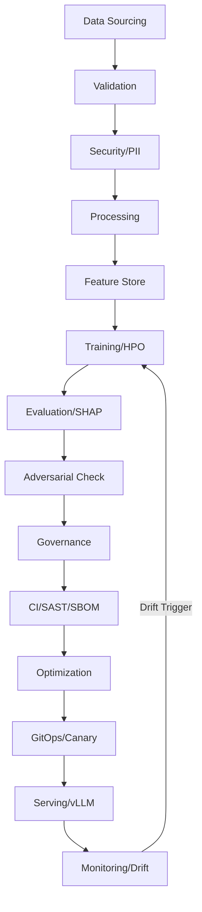

# 📝 SAMOS: Secure Advanced MLOps & Orchestration System

[](https://github.com/your-org/samos/actions/workflows/ci.yml)
[](https://codecov.io/gh/your-org/samos)
[](https://github.com/PyCQA/bandit)
[](https://github.com/astral-sh/ruff)

A high-assurance, end-to-end MLOps & DevSecOps factory for mission-critical AI workloads. Designed for both **Structured Data** and **SAMOS (LLM)** fine-tuning with 25 specialized phases of automated excellence.

> [!TIP]
> **New to SAMOS?** Check out the [SETUP_GUIDE.md](./SETUP_GUIDE.md) for detailed local run and deployment instructions.

✨ Features

- **DataOps Foundation**: Automated sourcing, validation (Great Expectations), PII masking (Presidio), and feature evolution.
- **MLOps Intelligence**: Distributed training, neural architecture search, hyperparameter optimization (Optuna), and experiment tracking (MLflow).
- **Distillation Forge**: High-performance multi-device distillation (NPU, iGPU, CUDA) with 80% compute saturation and 8GB RAM-reservation guard.
- **ModelSecOps Governance**: Adversarial robustness testing (ART), ethical bias audits, and immutable governance ledgers.
- **DevSecOps Purity**: Self-healing code, supply-chain hardening (SBOM), and automated red-teaming.
- **SRE & CD Resilience**: GitOps (ArgoCD), canary deployments, proactive drift forecasting, and planetary-scale latency sync.
- **Dual Pipeline Support**: Switch between specialized LLM fine-tuning and full 25-phase structured data factories.
- **Visual Intelligence**: Real-time interactive dashboards and automated architecture mapping.

🛠️ Tech Stack

| Technology | Purpose |
| :--- | :--- |
| **Python 3.12** | Core Runtime |
| **FastAPI** | High-Performance Serving |
| **MLflow** | Experiment Tracking & Model Registry |
| **DVC** | Data & Model Versioning |
| **Optuna** | Hyperparameter Optimization |
| **ART** | Adversarial Robustness Testing |
| **Docker** | Containerization |
| **Kubernetes** | High-Availability Orchestration |
| **ZAP** | Dynamic Application Security Testing (DAST) |
| **Bandit/Ruff** | Static Analysis Security Testing (SAST) |

🚀 Quick Start

Prerequisites

- **Python 3.12+**
- **Docker** (for containerized deployment)
- **PostgreSQL** (Optional, defaults to SQLite for local tracking)

Setup

```powershell
# Clone the repository
git clone https://github.com/your-org/samos.git
cd samos

# Run the high-assurance setup script
.\setup.ps1
```

Manual Setup

```bash
# 1. Install specialized dependencies
pip install -r requirements.txt

# 2. Initialize tracking ledger
export MLFLOW_TRACKING_URI="sqlite:///mlflow.db"

# 3. Launch the factory (Structured Mode)
python main.py

# 4. Launch the factory (LLM Mode)
python main.py llm

# 5. Launch the Optimized Forge (NVIDIA + Intel Swarm)
python samos_master.py

# 6. Start the production neural core
uvicorn src.sre.serve:app --host 0.0.0.0 --port 7860
```

🔐 System Access

| Domain | Access Level | Description |
| :--- | :--- | :--- |
| **Operator** | Full Access | Complete control over the 25-phase factory |
| **Auditor** | Read-Only | Access to governance ledgers and bias reports |
| **Researcher** | Experiment Access | Create and track new training runs in MLflow |

📡 Pipeline Components

Execution Orchestration

| Method | Command | Description |
| :--- | :--- | :--- |
| **POST** | `/predict` | Inference via the Production Neural Core |
| **GET** | `/health` | SRE Liveness and Readiness check |
| **RUN** | `python main.py` | Full 25-phase Structured Pipeline |
| **RUN** | `python main.py llm` | Specialized LLM Fine-Tuning Pipeline |
| **RUN** | `python samos_master.py` | Optimized 1B Forge (NVIDIA + Intel) |

SRE & Monitoring

| Component | Endpoint / Script | Description |
| :--- | :--- | :--- |
| **Dashboard** | `samos_dashboard.html` | Real-time command center |
| **Drift** | `src/sre/concept_drift.py` | Continuous monitoring for data drift |
| **Response** | `src/sre/incident_response.py` | Autonomous incident mitigation |

🔍 CLI Arguments & Granular Control

The SAMOS Command Center (`samos.py`) provides granular control over each of the 25 pipeline phases.

| Argument | Description | Example |
| :--- | :--- | :--- |
| `--phase <N>` | Trigger a specific phase (1-25) | `samos --phase 1` |
| `--phases <N,M,...>` | Trigger multiple specific phases | `samos --phases 1,3,9` |
| `--phases <N-M>` | Trigger a range of phases | `samos --phases 1-5` |
| `--group <name>` | Trigger a domain group | `samos --group dataops` |
| `--groups <a,b>` | Trigger multiple domain groups | `samos --groups dataops,mlops` |
| `--all` | Trigger the full 25-phase pipeline | `samos --all` |

## 🏢 Enterprise Domain Groups

- **Integrations**: Phase 0 (Apache NiFi, Airflow Sync, Prometheus Telemetry)
- **DataOps**: Phases 1-6 (Sourcing, Validation, Privacy, Processing, Genealogy)
- **MLOps**: Phases 7-11 (Active Learning, RLHF, Training, AutoML, Knowledge Graphs)
- **ModelSecOps**: Phases 12-16 (Evaluation, Bias Audit, Robustness, Governance)
- **DevSecOps**: Phases 17-21 (Serving Security, Hardening, Audit, Red-Team, Optimization)
- **SRE**: Phases 22-25 (Scaling, Routing, Economics, Monitoring, Terminal Audit)

## 🚀 SAMOS Enterprise Ultra-Stack (75 Tools)

SAMOS now features a full 75-tool enterprise-grade orchestration layer, spanning five critical domains.

### 📊 Strategic Domains & Tooling

| Domain | Key Tools (Total 75) |
| :--- | :--- |
| **DataOps** | Kafka, Spark, Airflow, dbt, Iceberg, Flink, Trino, Delta Lake, DuckDB, ClickHouse, NiFi |
| **MLOps** | MLflow, Kubeflow, DVC, Feast, Ray, BentoML, Triton, ONNX, Hugging Face, Optuna |
| **ModelSecOps** | Garak, SHAP, LIME, Fairlearn, ART, Presidio, Guardrails AI, Counterfit |
| **SRE** | Prometheus, Grafana, OpenTelemetry, Jaeger, Loki, Chaos Mesh, k6, Istio, KEDA |
| **DevSecOps** | Trivy, OWASP ZAP, Semgrep, Falco, OPA, Cosign, Gitleaks, Vault, SonarQube |

### Launching the Ultra-Stack

```bash
# Start the core stack with Enterprise profiles
docker-compose --profile nifi --profile airflow up -d

# Synchronize all 75 tools via the CLI
samos --group integrations
```

---

📂 Project Structure

```text
samos/
├── src/
│   ├── data_ops/      # Sourcing, Validation, Masking
│   ├── ml_ops/        # Training, HPO, Distillation
│   ├── model_sec/     # Adversarial, Bias, Governance
│   ├── devsecops/     # SAST/DAST, Self-Healing Code
│   └── sre/           # Serving, Monitoring, Incident Response
├── configs/           # Pipeline & Hardware configurations
├── models/            # Champion models & Versioning
├── tests/             # High-assurance test suite
├── Dockerfile         # Optimized container definition
├── main.py            # Master Orchestrator
└── README.md          # System Manual
```

🔄 Intelligence Workflow



🛡️ Compliance & Security

| Standard | Status | Implementation |
| :--- | :--- | :--- |
| **SOC2 / HIPAA** | Aligned | PII Masking & Differential Privacy |
| **GDPR** | Compliant | Automated "Right to be Forgotten" Purge |
| **Model Security** | Hardened | Adversarial Robustness & Zero-Knowledge Proofs |

## 📥 How to Ingest Raw Data

The SAMOS pipeline is designed to ingest data from multiple sources. You can fill the pipeline with your own raw data using the following methods:

### Method 1: Local File Drop (Easiest)

Simply place your CSV files in the `data/raw/` directory.

- Create the directory if it doesn't exist: `mkdir data/raw`
- Drop your `.csv` files into it.
- Run the ingestion phase: `samos --phase 1`
- *The system will automatically detect, merge, and normalize your files into the "Bronze" data lake.*

### Method 2: Apache NiFi (Enterprise)

Use the integrated Apache NiFi instance to orchestrate complex data flows.

1. Launch the stack: `docker-compose up -d`
2. Access NiFi at `https://localhost:8443`
3. Route your data to the `SAMOS_OUT` port.
4. Run: `samos --group integrations` to sync.

### Method 3: Kafka Streaming (Real-time)

Push your events directly to the Kafka backbone.

1. Produce messages to the `samos_events` topic.
2. The `src/data_ops/kafka_backbone.py` service will ingest them into the pipeline.
